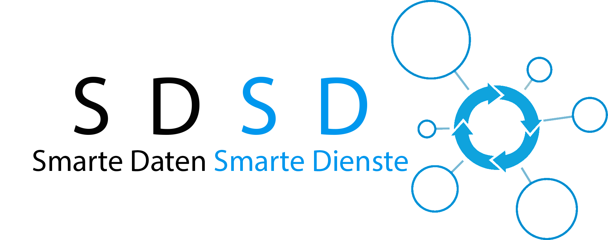

# SDSD

Smart Data - Smart Services

Modern agricultural technology and the increasing digitalisation of such processes provide a wide range of data. 
However, their efficient and beneficial use suffers from legitimate concerns about data sovereignty and control, format inconsistencies and different interpretations. 
As a proposed solution, we present [Wikinormia](sdsd-api), a collaborative platform in which interested participants can describe and discuss their own new data formats. 
Once a finalized vocabulary has been created, specific [parsers](parser) can semantically process the raw data into three basic representations: spatial information, time series and semantic facts (agricultural knowledge graph). 
Thanks to publicly accessible definitions and descriptions, developers can easily gain an overview of the concepts that are relevant to them. 
A variety of services will then (subject to individual access rights) be able to query their data simply via a [query interface](website/src/main/java/de/sdsd/projekt/prototype/jsonrpc/ApiEndpoint.java#L82) and retrieve results (by using JSON-RPC).
We have implemented this proposed solution in a prototype in the SDSD project which has been made open-source here.

Visit our german [project homepage](http://www.sdsd-projekt.de/) for more information.

A [paper](https://gil-net.de/wp-content/uploads/2020/02/GIL_2020FK_LNI-gesamt.pdf#page=133) about this topic can be cited with this bibtex:
```
@article{klose2020datenaufbereitung,
  title={Datenaufbereitung in der Landwirtschaft durch automatisierte semantische Annotation},
  author={Klose, Julian and Schr{\"o}der, Markus and Becker, Silke and Bernardi, Ansgar and Ruckelshausen, Arno},
  journal={40. GIL-Jahrestagung, Digitalisierung f{\"u}r Mensch, Umwelt und Tier},
  year={2020},
  publisher={Gesellschaft f{\"u}r Informatik eV}
}
```
There is also an [English version of the paper on arxiv](https://arxiv.org/abs/1911.06606).

## Overall architecture of SDSD - what all modules are using databases

1. MongoDB: ListFunctions.java, GeoFunctions.java

2. Redis

3. Stardog: TripleFunctions.java

4. Cassandra: TabelFunctions.java

## Where to add configurations like DB credentials, default admin credentials etc
SDSD uses for the configuration of DB credential and other credentials a file called "settings.json".To run SDSD properly the used parser JARs and the settings.json file must be found in the Eclipse working directory (see IDE.md). The settings.json file contains a JSON structure which is sorted by the services used by SDSD to fill in your own credentials. For further information (e.g. the agrirouter) see Deliverable 5.2. For the correct configuration of the databases you have to specify
the adresses and ports to access them. Furthermore the settings.json file provides the means to specify the admin password for the plattform. Do **not** send the file to an unauthorized person. In the following snippet a template for the settings.json file can be found. All places marked with "???" should be fullfilled.
```javascript
{
        "agrirouter": {
            "endpointIdPrefix": "urn:sdsd:",
            "host": "https://goto.my-agrirouter.com",
            "onboardingUrl": "https://agrirouter-registration-service.cfapps.eu1.hana.ondemand.com/api/v1.0/registration/onboard",
            "applicationId": "???",
            "certificationVersionId": "???",
            "capabilities": [
                { "technicalMessageType": "iso:11783:-10:taskdata:zip", "direction": 2 },
                { "technicalMessageType": "iso:11783:-10:device_description:protobuf", "direction": 2 },
                { "technicalMessageType": "iso:11783:-10:time_log:protobuf", "direction": 2 },
                { "technicalMessageType": "shp:shape:zip", "direction": 2 },
                { "technicalMessageType": "img:bmp", "direction": 2 },
                { "technicalMessageType": "img:jpeg", "direction": 2 },
                { "technicalMessageType": "img:png", "direction": 2 },
                { "technicalMessageType": "vid:avi", "direction": 2 },
                { "technicalMessageType": "vid:mp4", "direction": 2 },
                { "technicalMessageType": "vid:wmv", "direction": 2 },
                { "technicalMessageType": "doc:pdf", "direction": 2 }
            ],
            "appPrivateKey": "???",
            "arPublicKey" : "MIIBIjANBgkqhkiG9w0BAQEFAAOCAQ8AMIIBCgKCAQEAwCxD31sYtzH9NTfZ6n8H+H/QgOaoTL9GAakplAsdwYSLjBpgYMZOHIgkdM9ksRP8WsITChtZtxrCnBjR8bapekPT/pM9zPZlNEPxUlylJNwwTWjzTJP03+Yr07Q8v8fTJ5VWzAHlHtGQ/sI7yXA8pzruTNre1MzxO3lkljt2Q2e7CVXAp1b53BghgysppL9Bl7NK1R+vdWSs0B1Db/GjalOkWUnhivTjRMX61RGDCQSVSEaX12EvJX7FooAsW3NFeZCgeZGWEa5ZMALIiBL4GNASOOHju7ewlYjkyGIRxxAoc3C0w5dg1qlLiAFWToYwgDOcUpLRjU/7bzGiGvp8RwIDAQAB"
        },
        "agrirouter-qa": {
            "endpointIdPrefix": "urn:sdsd:",
            "host": "https://agrirouter-qa.cfapps.eu10.hana.ondemand.com",
            "onboardingUrl": "https://agrirouter-registration-service-hubqa-eu10.cfapps.eu10.hana.ondemand.com/api/v1.0/registration/onboard",
            "applicationId": "???",
            "certificationVersionId": "???",
            "capabilities": [
                { "technicalMessageType": "dke:other", "direction": 2 },
                { "technicalMessageType": "iso:11783:-10:taskdata:zip", "direction": 2 },
                { "technicalMessageType": "iso:11783:-10:device_description:protobuf", "direction": 2 },
                { "technicalMessageType": "iso:11783:-10:time_log:protobuf", "direction": 2 },
                { "technicalMessageType": "shp:shape:zip", "direction": 2 },
                { "technicalMessageType": "img:bmp", "direction": 2 },
                { "technicalMessageType": "img:jpeg", "direction": 2 },
                { "technicalMessageType": "img:png", "direction": 2 },
                { "technicalMessageType": "vid:avi", "direction": 2 },
                { "technicalMessageType": "vid:mp4", "direction": 2 },
                { "technicalMessageType": "vid:wmv", "direction": 2 },
                { "technicalMessageType": "doc:pdf", "direction": 2 }
		],
		"appPrivateKey": "???",
		"arPublicKey" : "MIIBIjANBgkqhkiG9w0BAQEFAAOCAQ8AMIIBCgKCAQEAy8xF9661acn+iS+QS+9Y3HvTfUVcismzbuvxHgHA7YeoOUFxyj3lkaTnXm7hzQe4wDEDgwpJSGAzxIIYSUXe8EsWLorg5O0tRexx5SP3+kj1i83DATBJCXP7k+bAF4u2FVJphC1m2BfLxelGLjzxVAS/v6+EwvYaT1AI9FFqW/a2o92IsVPOh9oM9eds3lBOAbH/8XrmVIeHofw+XbTH1/7MLD6IE2+HbEeY0F96nioXArdQWXcjUQsTch+p0p9eqh23Ak4ef5oGcZhNd4ypY8M6ppvIMiXkgWSPJevCJjhxRJRmndY+ajYGx7CLePx7wNvxXWtkng3yh+7WiZ/YqwIDAQAB"
	},
	"redis": {
		"address": "redis://127.0.0.1:6379/"
	},
	"mongodb": {
		"address": "???",
		"user": "sdsd",
		"database": "sdsd",
		"password": "???"
	},
	"stardog": {
		"update": "???/sdsd/update",
		"query": "???/sdsd/query",
		"user": "???",
		"password": "???"
	},
	"cassandra": {
		"address": "???",
		"port": 9042,
		"keyspace": "sdsd",
		"user": "???",
		"password": "???"
	},
	"adminPassword": "???"
}
```
## What all packages are missing - from where to fetch it and where to place it?
In this repository no .proto files are included. You have to download and add them to your environment on your own. They have to be added to the corresponding directory in the Eclipse project.
+ agrirouter proto files: [https://github.com/DKE-Data/agrirouter-api-protobuf-definitions/tree/develop/java/src/main/resources/com/dke/data/agrirouter/proto](https://github.com/DKE-Data/agrirouter-api-protobuf-definitions/tree/develop/java/src/main/resources/com/dke/data/agrirouter/proto)
+ SAP proto files: 
+ gps.proto: [https://github.com/DKE-Data/agrirouter-tmt-protobuf-definitions/tree/develop/java/src/main/resources/com/dke/data/agrirouter/proto/technicalmessagetype](https://github.com/DKE-Data/agrirouter-tmt-protobuf-definitions/tree/develop/java/src/main/resources/com/dke/data/agrirouter/proto/technicalmessagetype)
+ gprc-efdi.proto: contact agrirouter support: support@my-agrirouter.com

## Standard port for the services
The standard port SDSD uses for the services is the port 8081. Pay attention to not to block it with your firewall.

## Default URL of web - portal and wikinormia 
The default URL is [https://app.sdsd-projekt.de](https://app.sdsd-projekt.de). 

**Attention:** This URL is hardcoded at several places in the source code. If you want to change the URL make sure to change the code, too.

## Short description of the structure of the databases
MongoDB, Cassandra and Redis configure themselves after first start of SDSD. To configure the structure of Cassandra see [Deliverable 5.2](./D5.2.pdf). There you can find several scripts to configure Cassandra. Furthermore there are more information on the structure of SDSD.
