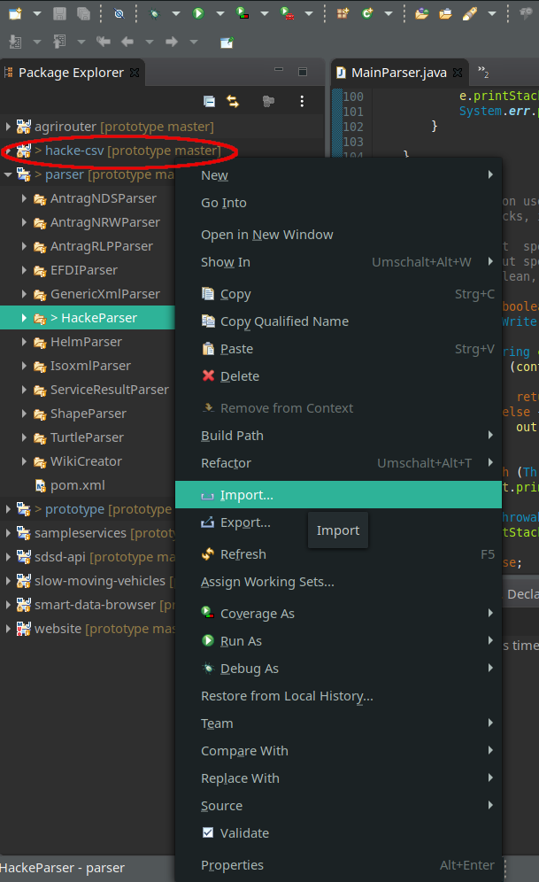

# Wikinormia 

Author: Noah Große Starmann\
Date: 2020-03-12\
Version: 0.1

Here is a brief overview of the use of Wikinormia. Wikinormia contains types that can be used with the SDSD platform. If you want to develop a parser for specified data types you must create according types. In SDSD are two main data stores for different types. A distinction must be made between TimeLog data, geodata and other data formats. While TimeLog data and geodata are stored in Cassandra database everything else has to be stored in the triple store database.

To create data types you have to do the following steps:

1. Click on Wikinormia button in the menu bar on project website (red marked in following image).

   

2. On the appearing site you can create a type or search for a type. To search specify name in the searching bar. To create a wikinormia type click on create. 

   

3. Now specify your type. You should choose whether the type is an instance of another type or not. Furthermore you must choose the format of your data. If the format of your data is not shown in the given drop down list you have to create a format with create format button. 

   

4. Here you must give an unique identifier, a title, a short description, a MIME-type and agrirouter Message Type. Leave agrirouter message type empty if you don't want to send data via the agrirouter. Chosse MIME-type according to Apache Tika MIME-types. Click on save button to save your new created format. Now specify the parser you want to use as jar file and set parser and test commands. Return to previous site and choose your format from the drop down menu.

   

   

5. After choosing the format specify an unique identifier, a title an a short description for your wikinormia type.

   

6. Specify Subclass of or Part of if necessary. Use the green + buttons. To specify multiple Subclass of or Part of press the green + button multiple times. Specify the identifier in the input field.

   

7. Attributes and instances must be added using the respective green + buttons.

8. Lastly click on Save button to save your Wikinormia type to the database. You can now access it via your code. 

   

# Create Parser for SDSD project

Author: Noah Große Starmann\
Date: 2020-03-12\
Version: 0.1

1. Create a new Maven project for your parser in parser package of SDSD source code. 

2. If you created a folder with source codes for package creation you may need to import it as Maven project to your Eclipse workspace. After clicking on import you should see your parser project in your workspace (red-marked in the image).

   

3. **Attention: You may have to fix the pom.xml of parser project and pom.xml for your package to work properly. You can see an example in the steps 4-6 below.**

4. Add your parser to modules at parser/pom.xml (red-marked).

   

5. Make sure in your pom.xml file that the artifactId is the same as the module name added in the last step.

   

6. Adjust the outputFile parameter to a fitting value.

   

7. Add to your parser project a MainParser class. It should contain the following structure. 

    ```java
      package de.sdsd.projekt.parser;
      
      public class Mainpublic class MainParser {
        public static void main(String[] args) throws IOException {
            if (args.length > 0) {
                InputStream in = args.length > 1 ? FileUtils.openInputStream(new File(args[1])) : System.in;
                OutputStream out = args.length > 2 ? FileUtils.openOutputStream(new File(args[2])) : System.out;
                switch (args[0].toLowerCase()) {
                case "parse":
                    parse(in, out);
                    break;
                case "test":
                    System.exit(test(in, out) ? 0 : 1);
                    break;
                default:
                    System.err.println("No parser specified ('parse', 'validate', 'test', 'isoxml')");
                    break;
                }
            } else
                System.err.println("USAGE: java -jar parser.jar parse|validate|test|isoxml filepath");
        }
      
        public static void parse(InputStream input, OutputStream output) {
            @TODO
          }
        public static boolean test(InputStream input, OutputStream output) {
            @TODO
        }
      
      }
    ```

8. MainFunction uses command line parameters to obtain the file to be parsed. The parsed values are written to OuputStream. OutputStream gives an ZIP file with parsed data. You can use it to check if your parser works correctly.

9. Write parse function. Use the functions of Parser API for adding parsed data to SDSD. You have to create fitting models in your Java code for later use with Wikinormia. Errors should be written to an errors list. This error list should be written to API with api.setErrors() **Attention: All TimeLog and Geo data should NOT be added to triple store with writeTriples() function. Use TimeLogWriter and GeoWriter classes and their corresponding functions instead.** Examples for suitable parser function can be found in the rest of the parser package. An example structure can be found in the following code snippet.

    ``` java 
      public static void parse(InputStream input, OutputStream output) {
      
        try (ParserAPI api = new ParserAPI(output)) {
            List<String> errors = new ArrayList<>();
            long t1 = System.nanoTime();
      
            try {   
                @TODO   
            } catch (Throwable e) {
                e.printStackTrace();
                errors.add(e.getMessage());
            }
      
            api.setParseTime((System.nanoTime() - t1) / 1000000);
            api.setErrors(errors);
            } catch (Throwable e) {
                e.printStackTrace();
                System.err.println(e.getMessage());
            }
      
        }
    ```

10. Write test function. The test function is executed when SDSD server can't recognize uploaded data which should be parsed. So make sure that your test function can clearly identify the data format to be parsed.

11. Now test both functions offline. To see if it works correctly set the command line parameters. For testing the parse function set it to "parse [path to your data] [path to store result ZIP]". For testing the test function you only need to specify "test [path to your data]".

    

    

12. After test of both functions is successful export your parser as .jar file to upload it to SDSD. 

    

    

    

13. Now create Wikinormia types and upload your parser. **See Wikinormia section**

# How to create a Jena RDF model

Author: Andreas Schliebitz\
Date: 2020-03-12\
Version: 0.1
       
Comments:
       
- Initial version of this document on how to create a Jena RDF model in Java. 
       
## Prerequisites

You have already read the ```Wikinormia.md``` section and successfully completed the following steps:

1. Creation of a custom Wikinormia format using the [SDSD online platfrom](app.sdsd-projekt.de/)
2. Creation of your custom Wikinormia resources (aka. schemata, tables) consisting of attribute names and data types.
       
## Maven projects dependencies
To create and write an [Apache Jena](https://jena.apache.org/) [RDF](https://en.wikipedia.org/wiki/Resource_Description_Framework) model, you'll need to add the following Maven dependencies to your project's  ```pom.xml```:
       
```xml
<dependencies>
    <dependency>
       <groupId>org.apache.jena</groupId>
       <artifactId>jena-core</artifactId>
       <version>3.14.0</version>
    </dependency>
    <dependency>
       <groupId>de.sdsd.projekt</groupId>
       <artifactId>sdsd-api</artifactId>
       <version>1.0.0</version>
    </dependency>
</dependencies>
```
       
## Basic Idea: Transforming a single row of data into an RDF entry

Lets assume we want to map the following dataset from the table ```Employee``` of a database ```CompanyData``` to an RDF model:
       
| Id   | Name | Age  | Birthday   | Salary  |
| ---- | ---- | ---- | ---------- | ------- |
| 1    | Bob  | 23   | 1996-12-24 | 1420.60 |

The corresponding Wikinormia format would be called  ```CompanyData```. Do not confuse the format's name with your custom Wikinormia schema names. In this case, the Wikinormia schema would be called ```Employee```. Think of a Wikinormia format as the name of a database and the schema as the header of a table inside that database.
       
1. Globally declare all your Wikinormia resources (aka. table names) as ```WIKI_RESOURCES```. You may use a mapping from the entity's class type to the corresponding Wikinormia resource. A resource is created by calling ```Util.toWikiResource()```  which binds the entities name to the Wikinormia format specifier ```WIKI_FORMAT```:
       
    ```java
    private static final Resource WIKI_FORMAT = Util.toWikiResource("CompanyData");
    private static final List<Class<?>> ENTITIES = Arrays.asList(Employees.class);

    private static final Map<Class<?>, Resource> WIKI_RESOURCES = createWikiResources();

    private static Map<Class<?>, Resource> createWikiResources() {
        HashMap<Class<?>, Resource> wikiResources = new HashMap<>();
        for (Class<?> entityClass : ENTITIES) {
            String entityName = entityClass.getSimpleName();
            wikiResources.put(entityClass, Util.toWikiResource(WIKI_FORMAT, entityName));
        }
        return wikiResources;
    }
    ```
2. Create an empty Jena RDF model:
       
    ```java
    import org.apache.jena.rdf.model.Model;
    import org.apache.jena.rdf.model.ModelFactory;

    Model model = ModelFactory.createDefaultModel();
    ```
       
3. Randomly generate a globally unique URI identifier for every row of data. Since we have only one row in our example, we only generate one identifier. This resource URI conceptionally **replaces** the ```Id``` attribute of our original ```Employee``` table.
       
    ```java
    Resource entityUriResource = Util.createRandomUriResource(model, entityResource, null);
    ```
       
    * Please note that the third parameter, which in this case is ```null```, creates a dependency relationship (```DCTerms.isPartOf```) to a parent Wikinormia resource. This is accomplished by using the random URI identifier of the corresponding parent resource as the third parameter of the above function.
       
4. If a row has a descriptive attribute, we use it's value as the label for the Jena entry. A label ```RDFS.label``` is bound to the random URI resource identifier of the current data row:
       
    ```java
    entityUriResource.addLiteral(RDFS.label, ResourceFactory.createTypedLiteral("Bob"));
    ```
       
5. Iterate over all attributes ```attrName``` of a data row and map the attribute values ```attrValue``` to Java data types. For numerical types, use the wrapper classes ```Integer```, ```Double```, etc. instead of the built-in primitive types like ```int``` and ```double```. Keep in mind, that zero initialized variables might contain an acceptable attribute value, although the original value was missing. ```Null``` values on the other hand nicely indicate a missing attribute. Do not try to create an RDF ```Literal``` from a missing and therefore ```null``` valued attribute; skip those instead. Jena is going to handle missing attribute values just fine if you don't add them to the RDF model. Please watch out for row attributes of type ```Date```, as those are not handled correctly by the generically overloaded ```ResourceFactory.createTypedLiteral()``` function.
       
    ```java
    import org.apache.jena.rdf.model.Literal;
    import org.apache.jena.rdf.model.Property;
    import org.apache.jena.rdf.model.Resource;
    import org.apache.jena.rdf.model.ResourceFactory;

    import de.sdsd.projekt.api.Util;
    import de.sdsd.projekt.parser.data.Employee;

    Resource entityResource = WIKI_RESOURCES.get(Employee.class);

    for (...) {
        if (attrValue == null)
           continue;

        Literal typedLiteral;

        if (attrValue instanceof Date)
           typedLiteral = Util.lit(((Date) attrValue).toInstant());
        else
           typedLiteral = ResourceFactory.createTypedLiteral(attrValue);

        Property wikiProperty = Util.toWikiProperty(entityResource, attrName);
        entityUriResource.addProperty(wikiProperty, typedLiteral);
    }
    ```
       
    After the literal ```typedLiteral``` was successfully created, we have to generate a Wikinormia ```Property``` using the ```Employee``` entity resource and the name ```attrName``` of the current attribute. In the next step we associate the literal ```typedLiteral``` with the ```wikiProperty``` (aka. table column) and add this (column, value) pair to the URI resource identifier ```entityUriResource``` of the current Jena RDF entry.
       
    For our single row example from our ```Employee``` table, the described process from above is explicitly shown below:
       
    ```java
    Resource entityResource = WIKI_RESOURCES.get(Employee.class);

    Property nameProperty = Util.toWikiProperty(entityResource, "Name");
    Property ageProperty = Util.toWikiProperty(entityResource, "Age");
    Property birthdayProperty = Util.toWikiProperty(entityResource, "Birthday");
    Property salaryProperty = Util.toWikiProperty(entityResource, "Salary");

    Literal nameLit = ResourceFactory.createTypedLiteral("Bob");
    Literal ageLit = ResourceFactory.createTypedLiteral(23);
    Literal birthdayLit = Util.lit(Instant.parse("1996-12-24"));
    Literal salaryLit = ResourceFactory.createTypedLiteral(1420.60);

    entityUriResource.addProperty(nameProperty, nameLit);
    entityUriResource.addProperty(ageProperty, ageLit);
    entityUriResource.addProperty(birthdayProperty, birthdayLit);
    entityUriResource.addProperty(salaryProperty, salaryLit);
    ```
       
6. Finally, we can use the SDSD ```ParserAPI``` function ```writeTriples``` to write our Jena RDF model into a ZIP compressed output stream:
       
    ```java
    import de.sdsd.projekt.api.ParserAPI;

    try (ParserAPI api = new ParserAPI(output)) {
        api.writeTriples(model);
    }
    ```
       
    * Please keep in mind, that GPS coordinates, surrogate ID attributes and TimeLog entries **do not** belong into the triplestore. You're therefore not allowed to include those attributes/values into your Jena RDF model.
       
    You can insert GPS coordinates into the geostore using the ```GeoWriter``` of the same ```ParserAPI```:
       
    ```java
    try (GeoWriter geo = api.writeGeo()) {
        geo.writeFeature(geoJSON, ElementType.Other, entityUriResource, geoLabel);
    }
    ```
       
For a real-world implementation of a Jena RDF model, including GPS coordinates, ```partOf``` references and surrogate IDs, please visit the Javadoc of the ```helm-csv``` parser project.